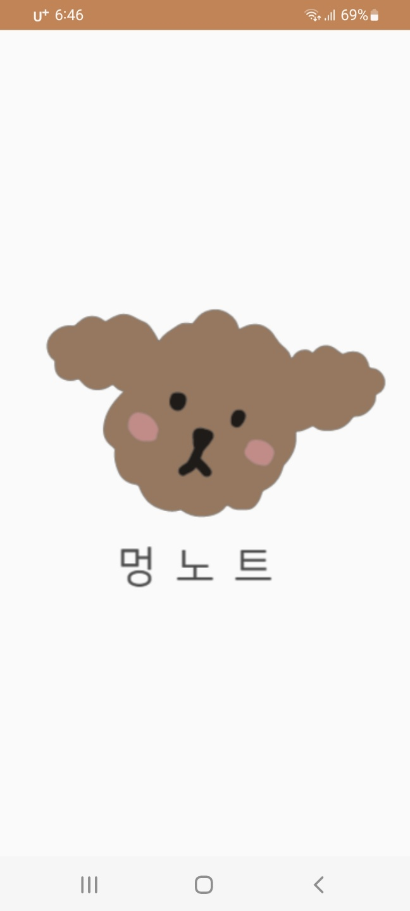
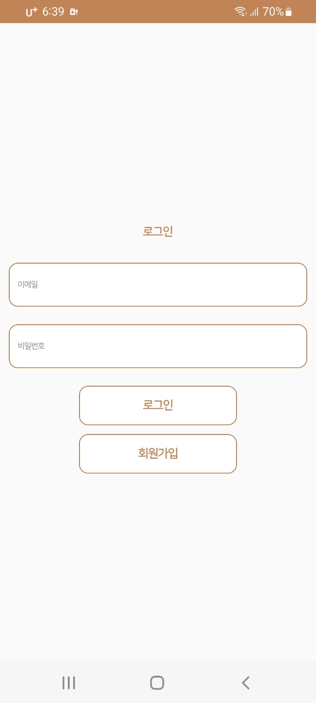
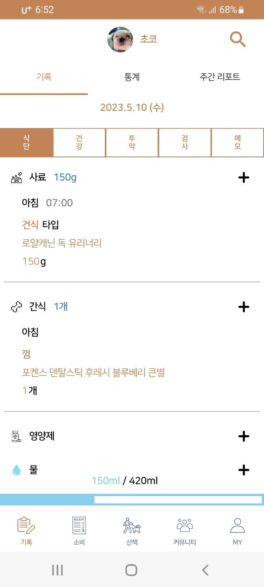
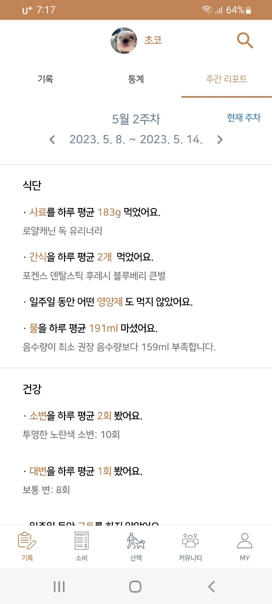
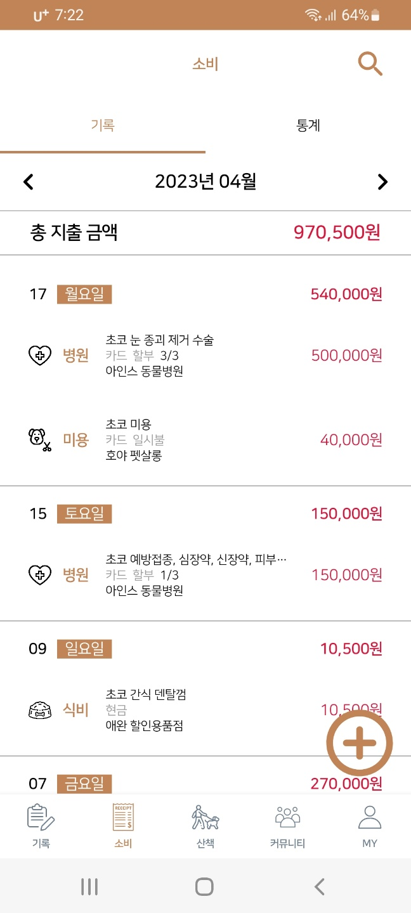
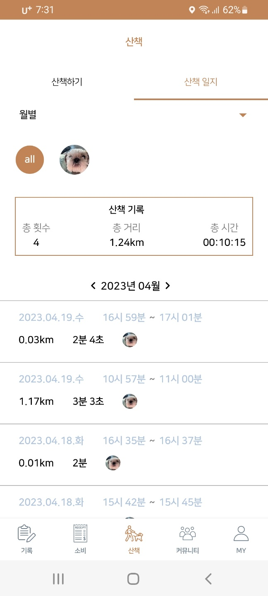
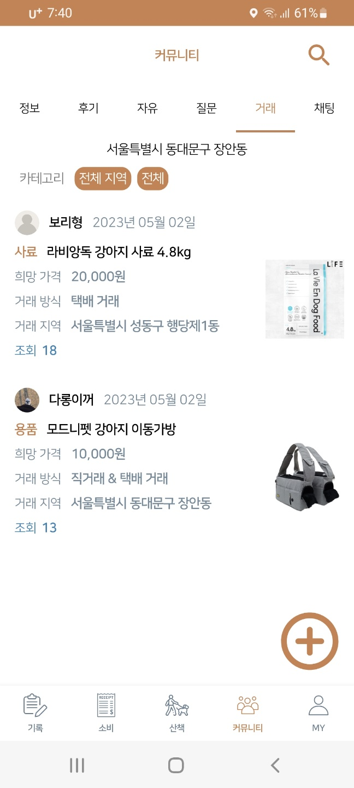
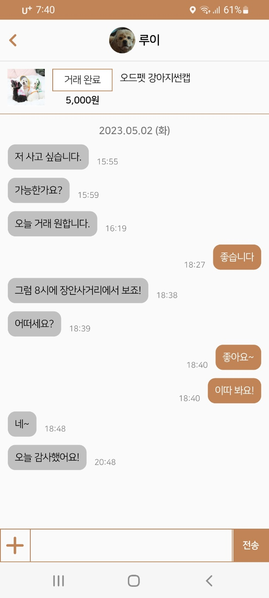
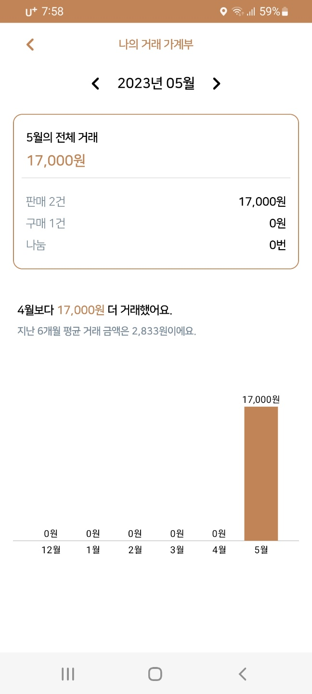
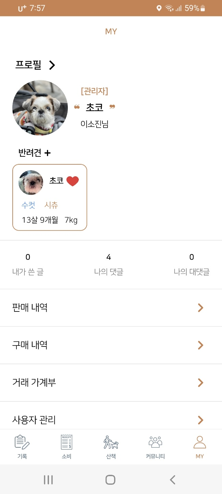

## 반려견 종합 관리 Android Application 🐶
자신의 반려견에 대한 모든 것을 한 번에 관리할 수 있도록 만든 안드로이드 어플리케이션입니다! 
반려견 보호자의 입장에 중점을 두고 개발하였습니다🌟
 
 

## 목차 ✔️
  - [개요](#개요)
  - [개발환경](#개발환경)
  - [화면](#화면)
  - [기능](#기능)

## 개요 ✏️
* 프로젝트 이름: 멍노트(Mung Note)
* 프로젝트 제작 기간: 2023.03-2023.05
* 개발 인원: 이소진(1인 개인 프로젝트)

## 개발환경 🛠️
* 개발 언어: Kotlin
* DB: Firebase
* IDE: Android Studio
* API, 라이브러리: RESTful API, Retrofit, OpenWeatherMap API, NaverMap API

## 화면 📱

  

    
    
    
    
    
    
    
    
    
    
  

## 기능 🖤
* 회원가입 및 로그인
* 반려견 정보 기록 및 통계
* 반려견 검사지표 추이 확인
* 반려견의 식단·건강·투약의 일주일의 주간 리포트 요약
* 반려견 소비 기록 및 통계
* 산책 기록 및 산책 일지
* 커뮤니티 및 채팅
* 나의 프로필 수정, 반려견 수정·추가, 판매·구매 내역, 거래 가계부, 대표 반려견 관리, 차단 목록 관리 

